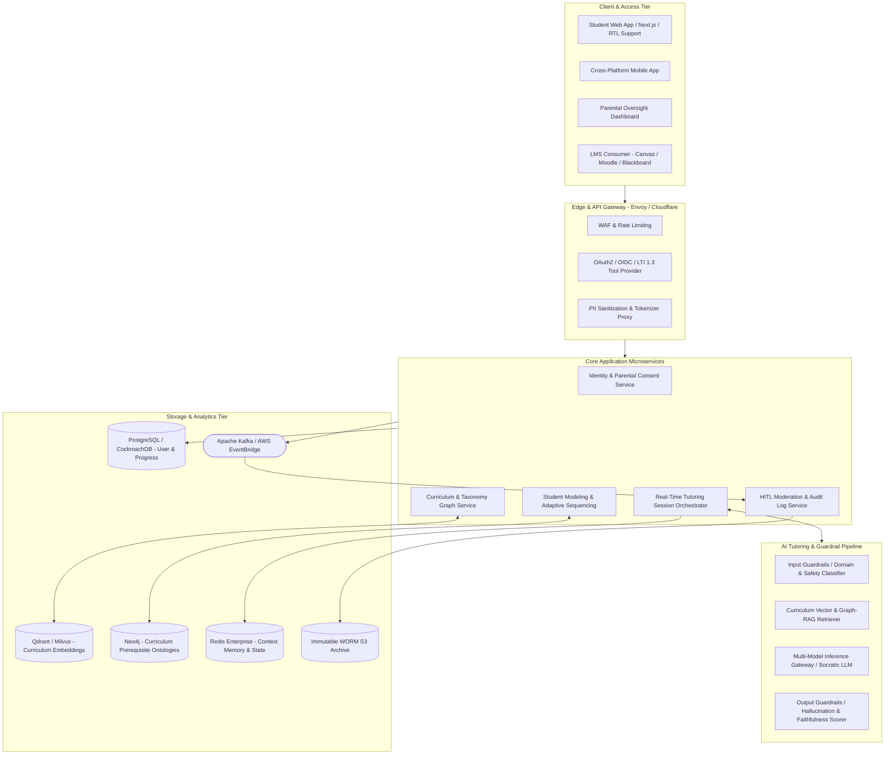
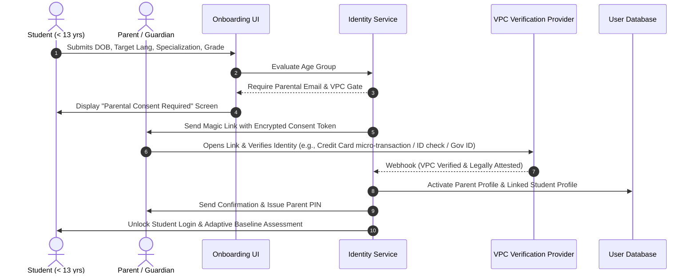
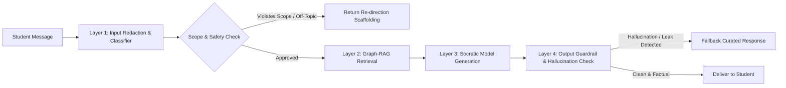
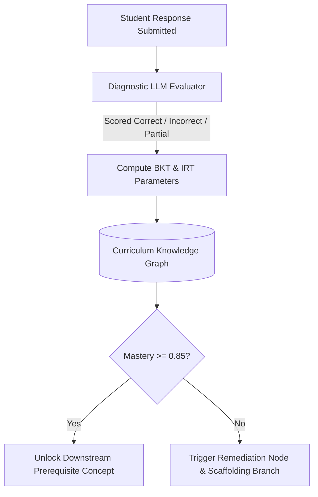
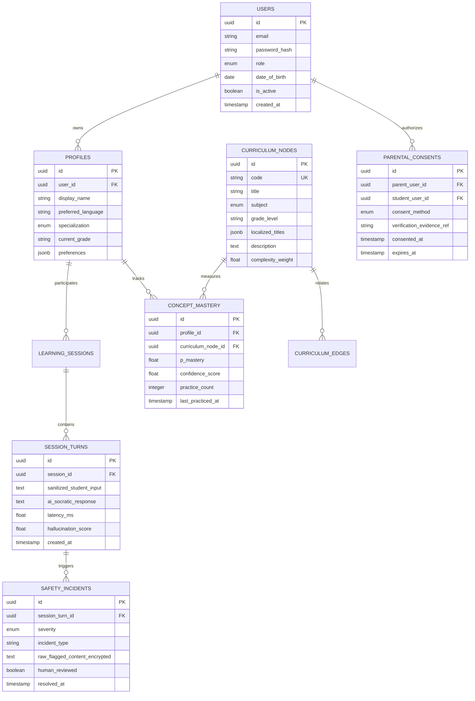
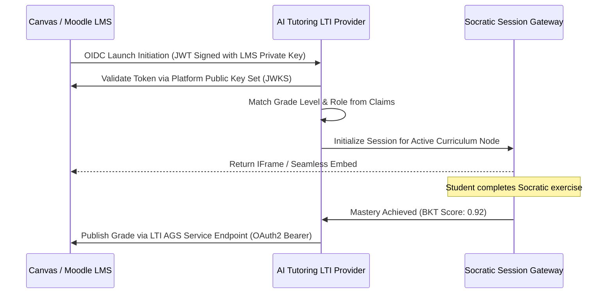
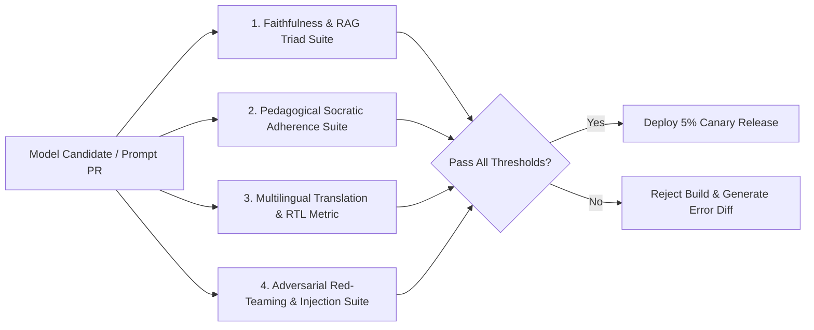
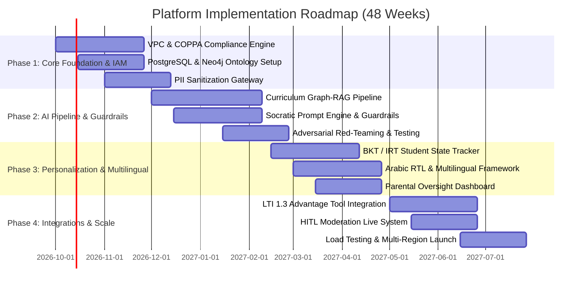

# Comprehensive Technical Architecture & System Specification: Multilingual AI Tutoring Platform

---

## 1. Executive Summary & Architectural Vision

The **AI Tutoring Platform** is an enterprise-grade, student-facing intelligent tutoring system (ITS) designed to deliver hyper-personalized, curriculum-aligned, and pedagogically sound learning experiences across multiple languages, academic disciplines, and age groups.

### Core Architectural Tenets
1. **Pedagogical Integrity (Socratic First)**: Prioritizes guided discovery and formative scaffolding over direct answer generation, adhering to the student's *Zone of Proximal Development* (ZPD).
2. **Deterministic Safety & Domain Isolation**: Hard boundaries ensure that students in a specific grade/specialization cannot encounter age-inappropriate or cross-disciplinary out-of-scope material.
3. **Multilingual Equity**: Native-level support for bidirectional scripts (e.g., Arabic RTL) and locale-specific curriculum alignment without translation degradation.
4. **Zero-Trust Privacy & Minor Protection**: Strict compliance with COPPA, FERPA, and GDPR-K via Verifiable Parental Consent (VPC), client-side and transit PII redaction, and strict data minimization.

---

## 2. High-Level System Architecture

The platform follows an asynchronous, event-driven microservices architecture partitioned into distinct security zones:



---

## 3. User Flows, Identity & Access Management (IAM)

### 3.1. Registration & Onboarding Lifecycle
Students are partitioned by age tier to enforce legal compliance:
- **Child Tier (<13 years)**: COPPA-mandated Verifiable Parental Consent (VPC) gate. Account creation paused until parental identity verification and consent sign-off.
- **Adolescent Tier (13–17 years)**: FERPA / GDPR-K parental notification with optional co-management.
- **Adult / Higher Ed Tier (18+)**: Direct standard registration.



### 3.2. Captured Registration Attributes
| Field Name | Type | Options / Formats | Validation Rules |
| :--- | :--- | :--- | :--- |
| `date_of_birth` | Date | `YYYY-MM-DD` | Immutable post-verification without parent ticket |
| `role` | Enum | `STUDENT`, `PARENT`, `INSTRUCTOR`, `ADMIN` | RBAC claim |
| `primary_language` | String | BCP-47 (`ar-SA`, `en-US`, `fr-FR`, `es-ES`, etc.) | Directs UI locale & LLM system prompt syntax |
| `specialization` | Enum | `K12_GENERAL`, `STEM_FOCUS`, `HUMANITIES`, `VOCATIONAL_TECH`, `PRE_MED` | Strict boundary filter for curriculum query scoping |
| `current_grade_level`| Enum | `G1` to `G12`, `UNDERGRAD_Y1` to `UNDERGRAD_Y4`, `POSTGRAD` | Bound by age validation matrix (e.g., 9yo cannot select `UNDERGRAD`) |
| `active_subjects` | Array | `["MATH_ALGEBRA_1", "SCI_CHEMISTRY", "LANG_ARABIC_LIT"]` | Limited to curriculum ontology nodes valid for grade level |
| `parent_account_id` | UUID | Nullable for adults, Foreign Key to `users.id` | Mandatory for students aged < 18 |

### 3.3. Parental Oversight Controls
Parents authenticate via biometric or 6-digit PIN into a segregated Parent Portal:
1. **Content & Topic Whitelist/Blacklist**: Exclude elective topics (e.g., specific literary texts, philosophical debates).
2. **Session & Screen Time Curfew**: Hard shutdown of tutoring sessions during specified hours.
3. **Real-Time Intervention**: Ability to view live transcripts and pause AI conversations instantly.
4. **Data Purge On-Demand**: "Right to Be Forgotten" one-click button invoking automated cryptographic erasure across all datastores.

---

## 4. Strict AI Tutoring Constraints & Domain Adherence

To prevent hallucinations, off-curriculum discussions, and inappropriate content leakage, the platform implements a **Four-Stage Context Defense (4SCD)**.



### 4.1. Domain Isolation & Content Guardrail Rules
1. **Specialization Quarantine**: If a student is registered under `STEM_FOCUS -> Physics (Grade 10)`, queries regarding unrelated adult topics, advanced non-curriculum concepts (e.g., college-level organic synthesis), or off-domain subjects (e.g., geopolitics, financial advice) trigger an automated pedagogical redirection.
2. **Vocabulary & Readability Scaffolding**: All generated outputs pass through a lexical density index (Flesch-Kincaid / Dale-Chall tuned per language). A Grade 4 output is constrained to max 12 words per sentence, while Grade 11 allows up to 25 words with technical terminology.
3. **Zero Direct-Answer Fallback**: The AI is systematically forbidden from solving homework directly (e.g., "The answer is 42"). It must decompose problems into guiding inquiries.

---

## 5. Content Generation, Prompt Patterns & Guardrail Architecture

### 5.1. Model Selection Strategy
| Pipeline Stage | Model Architecture | Justification | Latency SLA |
| :--- | :--- | :--- | :--- |
| **Input Classification & PII Redaction** | Fine-tuned DeBERTa-v3 / RoBERTa (ONNX Runtime) | Fast, deterministic token-classification on edge | < 25ms |
| **Curriculum Query Embedding** | `text-embedding-3-large` / `multilingual-e5-large` | State-of-the-art multilingual semantic alignment | < 50ms |
| **Primary Socratic Tutor** | Claude 3.5 Sonnet / GPT-4o / Llama 3.3 70B (Quantized) | Superior reasoning, nuance in pedagogy, native RTL fluency | < 900ms (TTFT) |
| **Output Hallucination & Safety Guard** | Specialized SLM (Llama-Guard-3-8B / NeMo Guardrails) | Sub-millisecond verification of faithfulness against retrieved context | < 80ms |

### 5.2. System Prompt Engineering Pattern (Socratic Tutor)

```markdown
# SYSTEM DIRECTIVE: ADAPTIVE SOCRATIC TUTOR
YOU ARE A CERTIFIED PEDAGOGICAL AI TUTOR SPECIALIZING IN: {{STUDENT_SPECIALIZATION}}
CURRENT TARGET SUBJECT: {{CURRENT_SUBJECT}}
STUDENT GRADE LEVEL: {{GRADE_LEVEL}} (AGE: {{STUDENT_AGE}})
INSTRUCTION LANGUAGE: {{LANGUAGE_LOCALE}} (Direction: {{TEXT_DIRECTION}})

## STRICT PEDAGOGICAL RULES:
1. NEVER PROVIDE DIRECT ANSWERS TO HOMEWORK, EQUATIONS, OR ESSAY PROMPTS.
2. BREAK COMPLEX PROBLEMS DOWN INTO 1-3 GUIDED MICRO-QUESTIONS.
3. ACKNOWLEDGE PARTIAL CORRECTNESS EMPATHETICALLY BEFORE CORRECTING MISCONCEPTIONS.
4. ADAPT YOUR VOCABULARY STRICTLY TO READABILITY TIER: {{READABILITY_GRADE_TIER}}.
5. REFERENCE ONLY THE GROUNDING CURRICULUM EXCERPTS PROVIDED BELOW.

## DOMAIN BOUNDARIES:
- Permitted Domain: {{CURRICULUM_DOMAIN_TAG}}
- Active Learning Objective: {{CURRENT_LEARNING_OBJECTIVE}}
- If the student attempts to switch to an unauthorized subject or asks inappropriate questions:
  Execute redirect: "That's an interesting question, but right now our focus is mastering {{CURRENT_TOPIC}}. Let's get back to step 2!"

## RETRIEVED CURRICULUM CONTEXT:
{{RAG_CONTEXT_BLOCK}}

## STUDENT MASTERY STATE (BKT):
- Known Concepts: {{MASTERY_HIGH_LIST}}
- Struggling Concepts: {{MASTERY_LOW_LIST}}
- Current Zone of Proximal Development: {{ZPD_TARGET_NODE}}

## OUTPUT FORMAT:
You MUST respond strictly in valid JSON adhering to this schema:
{
  "thought_process": "Internal pedagogical rationale (hidden from student)",
  "scaffolding_technique": "SOCRATIC_HINT | CONFIRMATION | MISCONCEPTION_PROBE",
  "pedagogical_response": "Student-facing response in {{LANGUAGE_LOCALE}}",
  "comprehension_check_question": "Single question testing the micro-step",
  "suggested_quick_replies": ["Option A", "Option B", "I need another clue"]
}
```

### 5.3. Guardrails Against Hallucination & Jailbreaking
- **Faithfulness Self-Checking (RAG Triad)**:
  1. *Context Relevance*: Embedding similarity between student query and retrieved curriculum chunks (Threshold: $\ge 0.82$).
  2. *Groundedness*: Generated response tokens must have $\ge 95\%$ semantic attribution to the context snippet.
  3. *Answer Relevance*: Ensures the Socratic question actually addresses the student's roadblock.
- **Adversarial Jailbreak Detection**:
  - Regular expression filters intercept prompt injection markers (`"Ignore previous instructions"`, `"System prompt override"`, `"DAN mode"`).
  - Semantic vector distance checking against known injection vectors via an embedded vector database cache.

---

## 6. Personalization, Adaptive Learning & Multilingual Engine

### 6.1. Student State Engine: Bayesian Knowledge Tracing (BKT) + Item Response Theory (IRT)
The platform tracks mastery of every micro-concept $c$ using standard BKT updated dynamically per turn:

$$P(L_{t+1}) = P(L_t \mid \text{Obs}) + (1 - P(L_t \mid \text{Obs})) \cdot P(T)$$

Where:
- $P(L_t)$: Probability that the student has mastered the concept at time $t$.
- $P(T)$: Probability of transition from unlearned to learned state.
- $P(G)$: Probability of guessing correctly despite not knowing (calibrated per question difficulty via IRT).
- $P(S)$: Probability of slipping (making an error despite knowing the concept).



### 6.2. Multilingual Localization & RTL Engineering
1. **Bilingual Ontology Mapping**: Curriculum topics are indexed with multilingual cross-lingual embeddings (e.g., standard CCSS Math concepts mapped to Arabic Egyptian Ministry, Saudi MoE, and French National curricula).
2. **True Bidirectional Rendering**:
   - Dynamic CSS layout switching (`dir="rtl"`, logical properties `margin-inline-start`).
   - Mixed-mode mathematical typography: Math equations rendered via MathJax/KaTeX using localized digit formats (Western Arabic `0, 1, 2` vs. Eastern Arabic numerals `٠, ١, ٢` based on regional curriculum standards).
3. **Dialectal & Regional Nuance Handling**: LLM prompts inject cultural and regional examples (e.g., currency units, local geography) appropriate to the student's country without altering the core scientific facts.

---

## 7. Data Models & Database Schemas

### 7.1. Entity Relationship Overview



### 7.2. Core PostgreSQL DDL Implementation

```sql
-- Enable necessary extensions
CREATE EXTENSION IF NOT EXISTS "uuid-ossp";
CREATE EXTENSION IF NOT EXISTS "pgcrypto";

-- User and Auth Tables
CREATE TYPE user_role AS ENUM ('STUDENT', 'PARENT', 'TEACHER', 'SYSTEM_ADMIN');
CREATE TYPE specialization_type AS ENUM ('K12_GENERAL', 'STEM_FOCUS', 'HUMANITIES', 'VOCATIONAL_TECH', 'PRE_MED');
CREATE TYPE verification_method AS ENUM ('CREDIT_CARD', 'GOV_ID', 'DIGITAL_SIGNATURE', 'TEACHER_ATTESTATION');
CREATE TYPE incident_severity AS ENUM ('INFO', 'LOW', 'MEDIUM', 'HIGH', 'CRITICAL');

CREATE TABLE users (
    id UUID PRIMARY KEY DEFAULT uuid_generate_v4(),
    email VARCHAR(255) UNIQUE NOT NULL,
    password_hash VARCHAR(255) NOT NULL,
    role user_role NOT NULL,
    date_of_birth DATE NOT NULL,
    is_active BOOLEAN DEFAULT TRUE,
    created_at TIMESTAMPTZ DEFAULT CURRENT_TIMESTAMP,
    updated_at TIMESTAMPTZ DEFAULT CURRENT_TIMESTAMP
);

CREATE TABLE parental_consents (
    id UUID PRIMARY KEY DEFAULT uuid_generate_v4(),
    parent_user_id UUID NOT NULL REFERENCES users(id) ON DELETE CASCADE,
    student_user_id UUID NOT NULL REFERENCES users(id) ON DELETE CASCADE,
    consent_method verification_method NOT NULL,
    verification_evidence_ref TEXT NOT NULL, -- Encrypted KMS reference
    is_revoked BOOLEAN DEFAULT FALSE,
    consented_at TIMESTAMPTZ DEFAULT CURRENT_TIMESTAMP,
    revoked_at TIMESTAMPTZ,
    CONSTRAINT unique_active_consent UNIQUE (parent_user_id, student_user_id)
);

CREATE TABLE student_profiles (
    id UUID PRIMARY KEY DEFAULT uuid_generate_v4(),
    user_id UUID UNIQUE NOT NULL REFERENCES users(id) ON DELETE CASCADE,
    display_name VARCHAR(100) NOT NULL,
    preferred_language VARCHAR(10) DEFAULT 'en-US', -- BCP-47
    specialization specialization_type NOT NULL DEFAULT 'K12_GENERAL',
    grade_level VARCHAR(20) NOT NULL,
    daily_time_limit_minutes INT DEFAULT 60,
    created_at TIMESTAMPTZ DEFAULT CURRENT_TIMESTAMP
);

-- Curriculum Ontology Nodes
CREATE TABLE curriculum_nodes (
    id UUID PRIMARY KEY DEFAULT uuid_generate_v4(),
    node_code VARCHAR(100) UNIQUE NOT NULL, -- e.g., 'MATH.ALG1.QUAD.01'
    subject VARCHAR(50) NOT NULL,
    grade_level VARCHAR(20) NOT NULL,
    title VARCHAR(255) NOT NULL,
    localized_metadata JSONB NOT NULL DEFAULT '{}',
    bloom_taxonomy_level VARCHAR(50) NOT NULL,
    is_active BOOLEAN DEFAULT TRUE
);

-- Prerequisite Graph Edges
CREATE TABLE curriculum_prerequisites (
    source_node_id UUID NOT NULL REFERENCES curriculum_nodes(id),
    target_node_id UUID NOT NULL REFERENCES curriculum_nodes(id),
    strength NUMERIC(3, 2) DEFAULT 1.0, -- Weighting of requirement
    PRIMARY KEY (source_node_id, target_node_id)
);

-- Student Knowledge Tracing State
CREATE TABLE student_concept_mastery (
    id UUID PRIMARY KEY DEFAULT uuid_generate_v4(),
    profile_id UUID NOT NULL REFERENCES student_profiles(id) ON DELETE CASCADE,
    curriculum_node_id UUID NOT NULL REFERENCES curriculum_nodes(id) ON DELETE CASCADE,
    p_mastery NUMERIC(4, 3) NOT NULL DEFAULT 0.100, -- 0.000 to 1.000
    guess_rate NUMERIC(4, 3) DEFAULT 0.200,
    slip_rate NUMERIC(4, 3) DEFAULT 0.100,
    practice_count INT DEFAULT 0,
    last_practiced_at TIMESTAMPTZ DEFAULT CURRENT_TIMESTAMP,
    CONSTRAINT unique_profile_node UNIQUE (profile_id, curriculum_node_id)
);

-- Audit & Safety Incidents
CREATE TABLE safety_incidents (
    id UUID PRIMARY KEY DEFAULT uuid_generate_v4(),
    session_id UUID NOT NULL,
    profile_id UUID NOT NULL REFERENCES student_profiles(id),
    severity incident_severity NOT NULL,
    incident_category VARCHAR(100) NOT NULL, -- e.g., 'PII_LEAK_ATTEMPT', 'UNAUTHORIZED_DOMAIN'
    encrypted_payload BYTEA NOT NULL, -- KMS encrypted raw incident
    moderator_reviewed BOOLEAN DEFAULT FALSE,
    action_taken VARCHAR(100),
    created_at TIMESTAMPTZ DEFAULT CURRENT_TIMESTAMP
);

CREATE INDEX idx_student_mastery_lookup ON student_concept_mastery (profile_id, curriculum_node_id);
CREATE INDEX idx_safety_incidents_pending ON safety_incidents (moderator_reviewed) WHERE NOT moderator_reviewed;
```

---

## 8. Privacy, Security & Legal Compliance (COPPA, FERPA, GDPR-K)

### 8.1. Data Minimization & PII Tokenization Flow
All incoming text runs through an edge-based anonymization pipeline before hitting any LLM API:

```
[Raw Student Input: "My name is Omar, and my teacher Mr. Smith gave me this equation: 3x + 5 = 14"]
                           │
                           ▼
          [Regex & Named Entity Recognition (NER)]
          - Extracts Names, Addresses, Phones, Emails
                           │
                           ▼
     [Token Vault: Replaces PII with Ephemeral Tokens]
     {"<STUDENT_NAME>": "Omar", "<TEACHER_NAME>": "Mr. Smith"}
                           │
                           ▼
[Sanitized Prompt to LLM: "My name is <STUDENT_NAME>, and my teacher <TEACHER_NAME> gave me this equation: 3x + 5 = 14"]
                           │
                           ▼
[LLM Generates Socratic Scaffolding using Tokens]
                           │
                           ▼
[Detokenizer: Re-populates Token Values on Client Device Display Only]
```

### 8.2. Compliance Matrix
| Regulation | Mandate | Technical Enforcement in System |
| :--- | :--- | :--- |
| **COPPA** (USA) | Parental consent before collecting minor's PII | Strict VPC gate via credit card verification ($0.50 transaction refunded) or ID verification. Zero direct training on student data. |
| **FERPA** (USA) | Protection of student educational records | Tenant-isolated databases with Row-Level Security (RLS). Integration strictly via encrypted LTI 1.3 Advantage keys. |
| **GDPR-K** (EU) | Right to Erasure, strict profiling limits | Automated erasure microservice: deletes DB records, purges Redis state, and issues tombstone records on analytics bus. |
| **Zero-Retention LLM** | No AI vendor data retention | Enterprise Business Associate Agreements (BAA) with Azure OpenAI / Anthropic specifying zero data logging and zero model fine-tuning on payloads. |

---

## 9. Integration, LMS & Operational Scalability

### 9.1. LMS Integration Architecture (LTI 1.3 / OneRoster)
The platform operates as an **LTI 1.3 Advantage Tool Provider**:
- **Assignment & Grade Services (AGS)**: Automatically syncs formative mastery scores and practice completion directly back to the teacher's gradebook in Canvas, Blackboard, or Moodle.
- **Names and Role Provisioning Services (NRPS)**: Securely syncs student course rosters without storing excess personal identifiable information.
- **Deep Linking**: Allows instructors to embed specific AI-tutored curriculum nodes directly into their LMS modular units.



### 9.2. Human-In-The-Loop (HITL) Moderation & Escalation
When safety guardrails flag a high-severity incident (e.g., self-harm ideation, harassment, unauthorized domain breach):
1. **Circuit Breaker**: The student session is immediately transitioned into a safe state ("Let's pause our session. A teacher or guardian has been notified to assist you.").
2. **Escalation Queue**: An alert is dispatched via Webhook to the HITL Moderator Dashboard with the encrypted transcript snippet.
3. **Parent / Counselor Dispatch**: For life-safety triggers, automated emergency webhooks notify registered parental emails and school counselors simultaneously.

### 9.3. High-Throughput & Low-Latency Infrastructure Spec
- **Edge Streaming**: Server-Sent Events (SSE) provide sub-second token streaming to minimize perceived student latency.
- **Context Window Management**: Token usage is optimized using a sliding-window memory with semantic summarization. Previous turns are compressed into a 200-token student state vector, preventing cost bloat and attention drift.
- **Multi-Region Deployment**: Kubernetes clusters deployed across three geopolitical regions (US-East, EU-Central, ME-Central) ensuring data residency compliance and sub-100ms API ping times.

---

## 10. Testing Protocols, Red-Teaming & Quality Assurance

### 10.1. Evaluation Framework & Benchmark Suites
Every model deployment passes through an automated CI/CD evaluation gate before production release:



### 10.2. Automated Benchmark Metrics & Thresholds
| Evaluation Category | Metric / Benchmark | Target Acceptance Threshold |
| :--- | :--- | :--- |
| **Faithfulness** | Ragas Faithfulness Score | $\ge 0.94$ |
| **Pedagogical Adherence** | Socratic Scaffolding Compliance (% of turns without direct answers) | $100\%$ |
| **Curriculum Scope** | Cross-specialization refusal precision | $\ge 0.99$ |
| **Multilingual Parity** | BLEU / chrF++ across Arabic, French, Spanish compared to English | chrF++ $\ge 65.0$ |
| **Safety & Jailbreaking** | Prompt Injection Benchmark (5,000 synthetic adversarial prompts) | $0.00\%$ breach rate |

---

## 11. Implementation Roadmap & Milestones



---

## 12. Key Performance Indicators (KPIs) & Target Metrics

| KPI Domain | Specific Metric | Target Production SLA |
| :--- | :--- | :--- |
| **Pedagogical Gains** | Average Effect Size (Cohen's $d$) on standardized post-tests | $d \ge 0.65$ (Significant learning gain) |
| **Safety & Moderation**| Severe content breaches reaching students | $0.00$ per 100,000 sessions |
| **Student Engagement** | 4-week active retention & session completion rate | $\ge 72\%$ completion of started learning paths |
| **System Latency** | Time to First Token (TTFT) via streaming SSE | $\le 850\text{ ms}$ (95th percentile) |
| **Domain Confinement** | False-positive deflection of in-curriculum questions | $\le 1.2\%$ |
| **Parental Confidence**| Parental consent conversion rate (VPC completion) | $\ge 68\%$ within 48 hours of invite |
